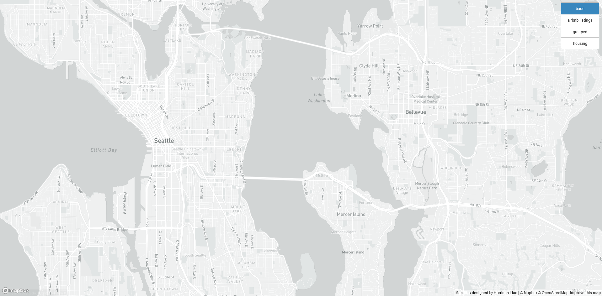
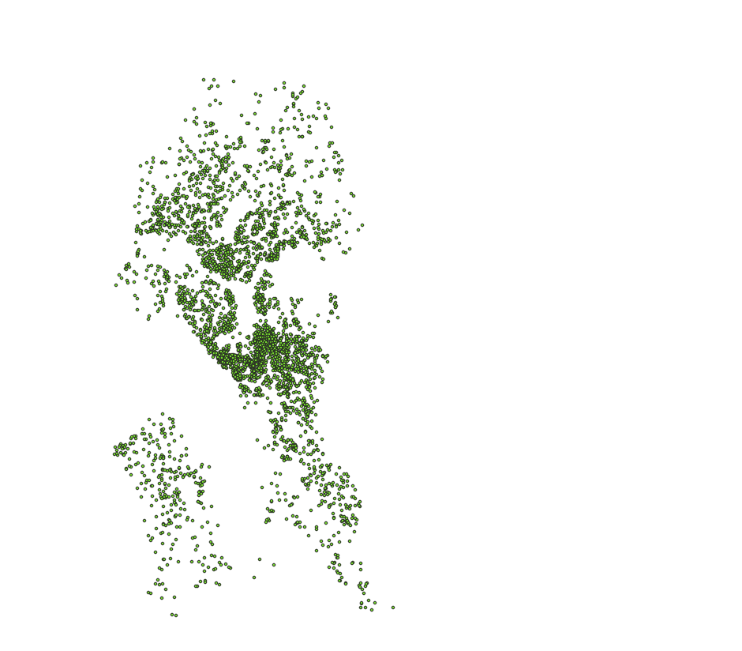
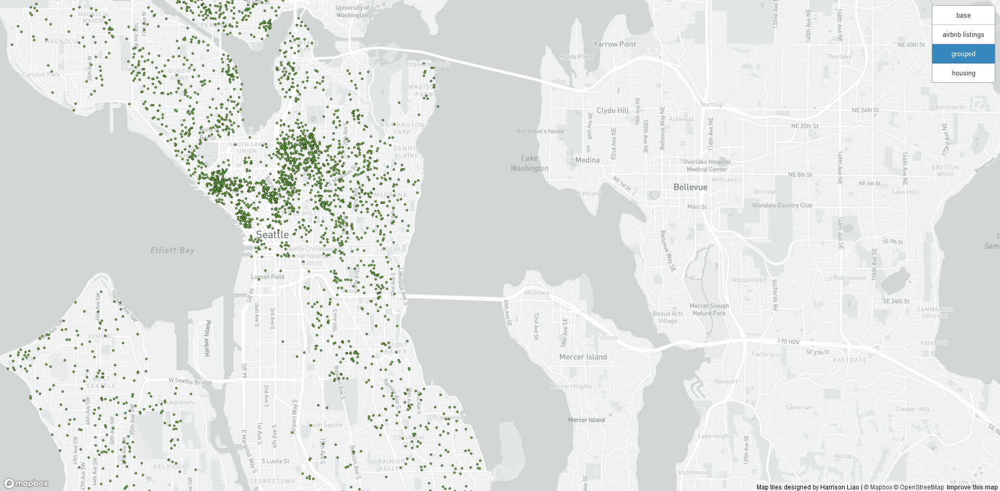
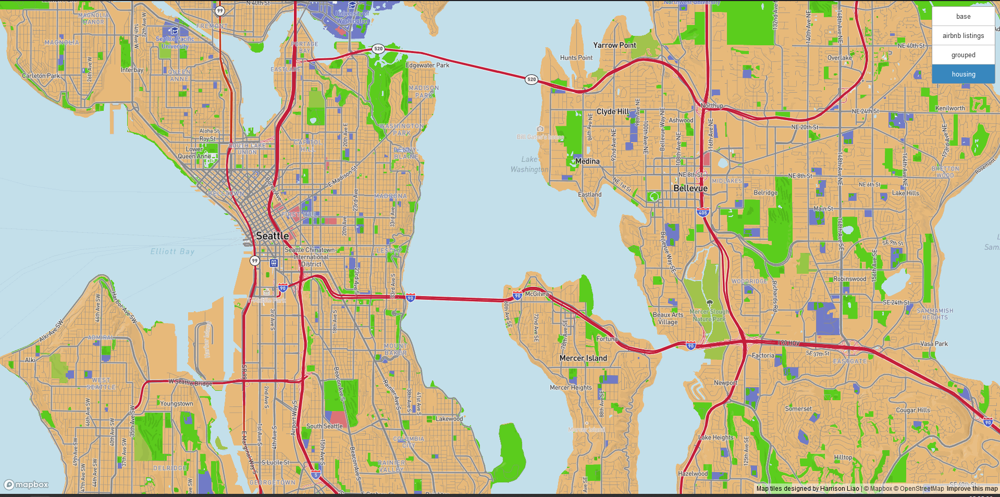

# Webmap Tiles of Airbnb Listings in Seattle
Harrison Liao || hxliaoay@uw.edu
Geog 458 AD

---

The map can be accessed at the URL:  https://hxliaoay.github.io/maplayers/

The examined geographic area is the City of Seattle, and the of [Airbnb listings (up to 2018) is pulled from Kaggle](https://www.kaggle.com/datasets/airbnb/seattle).  Zoom levels of all maps are fixed at min: 10 and max: 14.

Screenshots of the four tiles are followed in order and can be found below:

- Basemap, with icons and text tweaked
- thematic layer of Airbnb Listings up to 2018 in Seattle
- Grouped layer of the first two layers
- a reimagined industrial feel of Seattle

This basemap is made from OpenStreetMap

